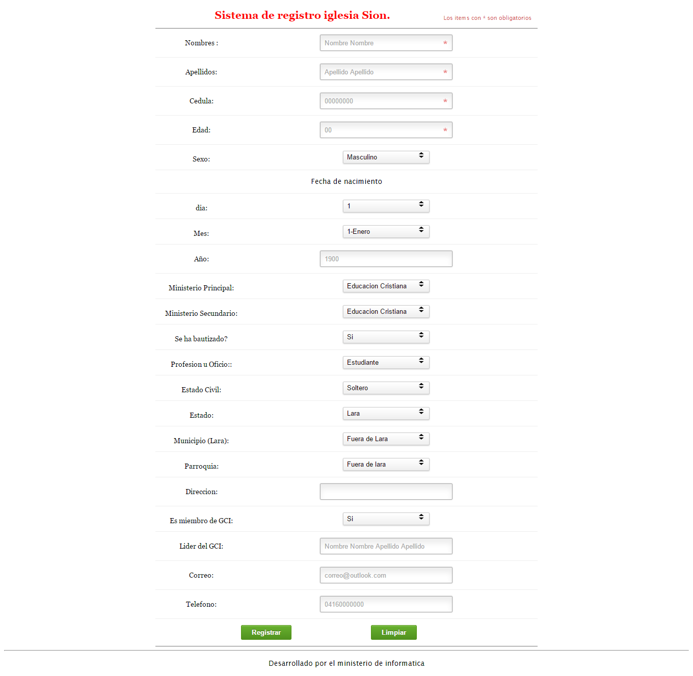

# (CENSO) Sistema simple para registro

Lo que necesitas modificar:


- registro.php

```registro.php
$conexion = mysql_connect("localhost","usuario_base_de_datos","clave_base_de_datos");
if (!$conexion) {
die("Fallo la conexión a la Base de Datos: " . mysql_error());
}

```

